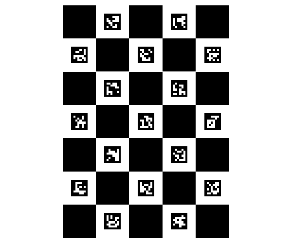

# Camera Calibration

### Create the Board

```python
import cv2

dictionary = cv2.aruco.getPredefinedDictionary(cv2.aruco.DICT_6X6_250)
board = cv2.aruco.CharucoBoard_create(squaresX=5,
                                      squaresY=7,
                                      squareLength=0.04,
                                      markerLength=0.02,
                                      dictionary=dictionary)

img = board.draw((600, 500), marginSize=100, borderBits=1)
cv2.imwrite('board.png', img)
```

Output:




### Capture images

```python
import cv2

cap = cv2.VideoCapture(0)

k = -1
i = 0
while k != 27:
    ret, frame = cap.read()
    if ret:
        cv2.imshow('', frame)
    k = cv2.waitKey(1)
    if ret and k == 32:
        cv2.imwrite('img-{}.png'.format(i), frame)
        i += 1
```

Output:


### Calculate camera parameters

```python
import cv2
import glob
import numpy as np

BOARD_SIZE = (5, 7)

criteria = (cv2.TERM_CRITERIA_EPS + cv2.TERM_CRITERIA_MAX_ITER, 30, 0.0001)
objp = np.zeros((BOARD_SIZE[0] * BOARD_SIZE[1], 3), np.float32)
objp[:, :2] = np.mgrid[0:BOARD_SIZE[0], 0:BOARD_SIZE[1]].T.reshape(-1, 2)

objpoints = []  # 3d point in real world space
imgpoints = []  # 2d points in image plane.

calibration_images_files = glob.glob('img-*.png')

for calibration_image_file in calibration_images_files:
    image = cv2.imread(calibration_image_file, cv2.IMREAD_GRAYSCALE)
    patternfound, corners = cv2.findChessboardCorners(image, BOARD_SIZE, None)
    if patternfound:
        corners2 = cv2.cornerSubPix(image,
                                    corners,
                                    (11, 11),
                                    (-1, -1),
                                    criteria)
        objpoints.append(objp)
        imgpoints.append(corners2)

ret, mtx, dist, rvecs, tvecs = cv2.calibrateCamera(objpoints,
                                                   imgpoints,
                                                   image.shape[::-1],
                                                   None,
                                                   None)

print mtx
print dist
```

Example output:
```
[[552.46232123   0.         373.69205778]
 [  0.         557.98743082 221.56448225]
 [  0.           0.           1.        ]]
[[ 1.14277568e+00 -1.21525625e+01 -2.35406466e-03  5.71528720e-04
   2.94663019e+01]]
```