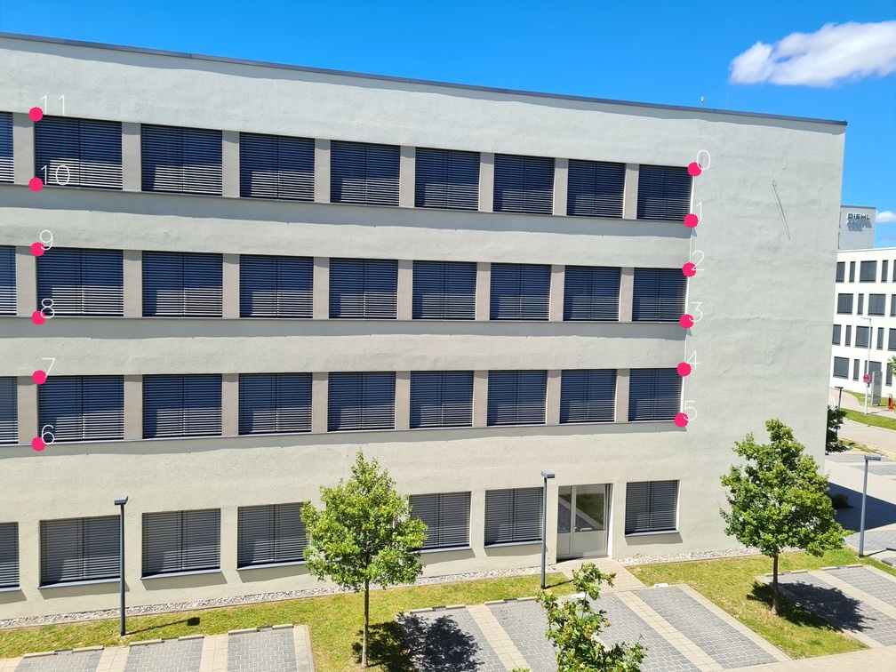
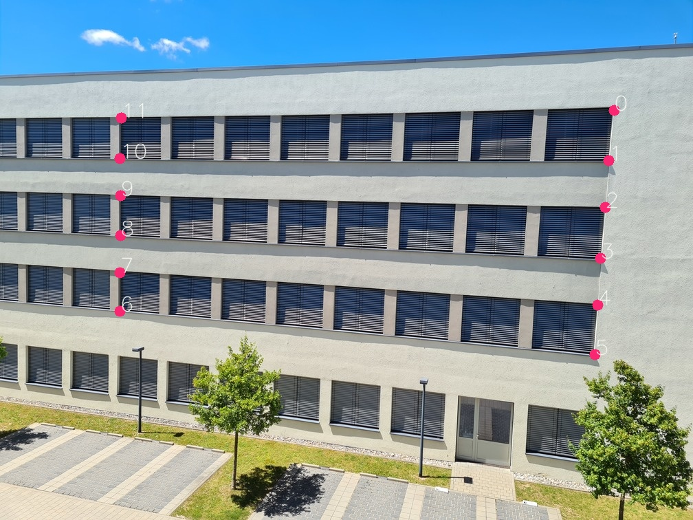

# Fundamental Matrix

Step 1: Have two images


Step 2: Select at least 8 corresponding points. [This tool](code/select_correspondances.py) will help. Example:




<details>

<summary>Points</summary>

```python
pts1 = [
    (782, 189),
    (778, 250),
    (774, 304),
    (771, 364),
    (769, 415),
    (767, 475),
    (43, 499),
    (44, 423),
    (41, 356),
    (40, 278),
    (39, 207),
    (40, 129)]
pts2 = [
    (892, 157),
    (886, 234),
    (879, 303),
    (874, 378),
    (869, 443),
    (864, 515),
    (172, 451),
    (174, 396),
    (174, 343),
    (175, 285),
    (174, 231),
    (175, 170)]
```
</details>


# Source 

[Coursera Robotics: Perception](https://www.coursera.org/learn/robotics-perception/lecture/WRyoL/epipolar-geometry-ii)