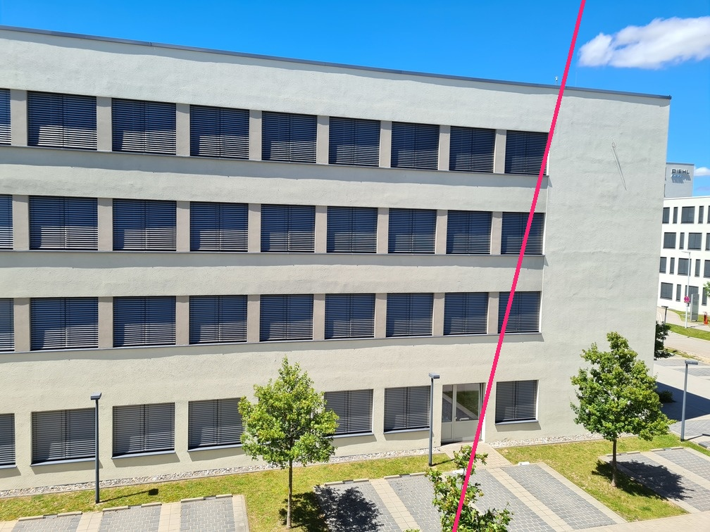

# Fundamental Matrix

Step 1: Have two images


Step 2: Select at least 8 corresponding points. Use [This tool](code/select_correspondances.py). Example:


<details>

<summary>Points</summary>

```python
pts1 = np.array([
    (782, 189),
    (778, 250),
    (774, 304),
    (771, 364),
    (769, 415),
    (767, 475),
    (43, 499),
    (44, 423),
    (41, 356),
    (40, 278),
    (39, 207),
    (40, 129)])
pts2 = np.array([
    (892, 157),
    (886, 234),
    (879, 303),
    (874, 378),
    (869, 443),
    (864, 515),
    (172, 451),
    (174, 396),
    (174, 343),
    (175, 285),
    (174, 231),
    (175, 170)])
```
</details>

Step 3: Construct **A** Matrix.

```python
A = np.empty((len(pts1), 9))
A[:, 0] = pts1[:, 0] * pts2[:, 0]
A[:, 1] = pts1[:, 0] * pts2[:, 1]
A[:, 2] = pts1[:, 0]
A[:, 3] = pts1[:, 1] * pts2[:, 0]
A[:, 4] = pts1[:, 1] * pts2[:, 1]
A[:, 5] = pts1[:, 1]
A[:, 6] = pts2[:, 0]
A[:, 7] = pts2[:, 1]
A[:, 8] = 1.0
```

Step 4: Solve equation

```python
U, D, Vt = np.linalg.svd(A)
F = Vt[8, :].reshape(3, 3).T
```

Step 5: Cleanup Matrix

```python
U, D, Vt = np.linalg.svd(F)
D[2] = 0.0
F = U.dot(np.diag(D)).dot(Vt)
```

<details>

<summary>Bonus: Draw point from A as line into B</summary>

```python
L2 = F.dot(np.hstack((pts1[0], 1)))

def f(x, L):
    a, b, c = L
    return int((-a*x-c) / b)

p1 = (-10000, f(-10000, L2))
p2 = (10000, f(10000, L2))
cv2.line(img2, p1, p2, (114, 38, 249))
```

Output:


</details>

<details>

<summary>Bonus: Draw point from B as line into A</summary>

```python
L1 = F.T.dot(np.hstack((pts2[0], 1)))

def f(x, L):
    a, b, c = L
    return int((-a*x-c) / b)

p1 = (-10000, f(-10000, L1))
p2 = (10000, f(10000, L1))
cv2.line(img1, p1, p2, (114, 38, 249))
```

Output:



</details>


# Source 

[Coursera Robotics: Perception](https://www.coursera.org/learn/robotics-perception/lecture/WRyoL/epipolar-geometry-ii)