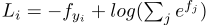

# Deep Learning

All steps one need to go through when using a neural networks.

## Data Preprocessing

### Step 1: Load data
```python
X, y = load_CIFAR10(cifar10_dir)
```

### Step 2: Split data
```python
num_training = 40000
num_test = 10000

mask = range(num_training)
X_train = X[mask]
y_train = y[mask]

mask = range(num_test, num_training + num_test)
X_test = X[mask]
y_test = y[mask]
```

Data should shape should look like this:
```python
print 'Training data shape: ', X_train.shape
print 'Training labels shape: ', y_train.shape
print 'Test data shape: ', X_test.shape
print 'Test labels shape: ', y_test.shape
```

```bash
Training data shape:  (40000, 32, 32, 3)
Training labels shape:  (40000,)
Test data shape:  (10000, 32, 32, 3)
Test labels shape:  (10000,)
```

### Step 3: Reshape X into 2D matrix

```python
X_train = np.reshape(X_train, (X_train.shape[0], -1))
X_test = np.reshape(X_test, (X_test.shape[0], -1))
print X_train.shape, X_test.shape
```

```bash
(40000, 3072) (10000, 3072)
```

The data layout for one training example is then as follows:

### Step 4: Subtract mean

```python
mean_image = np.mean(X_train, axis=0) # axis=0 means column-wise mean
X_train -= mean_image
X_test -= mean_image
```

also possible:

```python
X -= np.mean(X)
```

### Step 5: Normalization

* Only necessary if different input features have different scales
* Not necessary for image data

```python
X /= np.std(X, axis = 0)
```

### Step 6: PCA
```python
# Assume input data matrix X of size [N x D]
X -= np.mean(X, axis=0)  # zero-center the data (important)
cov = np.dot(X.T, X) / X.shape[0]  # get the data covariance matrix
U,S,V = np.linalg.svd(cov)
Xrot = np.dot(X, U)  # decorrelate the data
Xrot_reduced = np.dot(X, U[:, :100])  # Xrot_reduced becomes [N x 100]
```

* Very good performance by training linear classifiers or neural networks
* Savings in both space and time.

### Step 6: Whitening

```python
# whiten the data:
# divide by the eigenvalues (which are square roots of the singular values)
Xwhite = Xrot / np.sqrt(S + 1e-5)
```

### Step 7: Append one to feature vector

```python
X_train = np.hstack([X_train, np.ones((X_train.shape[0], 1))])
X_test = np.hstack([X_test, np.ones((X_test.shape[0], 1))])
```

## Network

### Weight initialization

* Small random numbers
```python
W = 0.01* np.random.randn(D,H)
```

* Calibrating the variances with `1/sqrt(n)`

```python
w = np.random.randn(n) / sqrt(n) # n is the number of inputs
```
* ensures that all neurons in the network initially have approximately the same output distribution
* empirically improves the rate of convergence
* For ReLU neurons
* Recommended by [ext. link](https://arxiv.org/abs/1502.01852)

```python
w = np.random.randn(n) * sqrt(2.0/n) # n is the number of inputs
```

### Bias initialization

* Set all to 0
* Some people like to use small constant, but it doesn't provide a consistent improvement

### Batch normalization

* Forces the activations throughout the network to take on a unit gaussian distribution
* Put BatchNorm layer immediately after fully connected layers or convolutional layers and before non-linearities
* Network becomes significantly more robust to bad initialization

### Forward pass

```python
# forward-pass of a 3-layer neural network:
ReLU = lambda x: x * (x > 0)
X = np.random.randn(3, 1) 
h1 = ReLU(np.dot(X, W1) + b1)
h2 = ReLU(np.dot(h1, W2) + b2)
out = np.dot(h2, W3) + b3
```

### Loss functions

#### Classification


##### Multiclass Support Vector Machine loss

* Used in SVM classifier
* The SVM loss function wants the score of the correct class y_i to be larger than the incorrect class scores by at least by Δ. [ext. link](http://cs231n.github.io/linear-classify/)
* Also called hinge loss or max-margin loss


* Squared hinge loss or L2-SVM
* Penalizes violated margins more strongly
* The unsquared version is more standard, but in some datasets the squared hinge loss can work better. This can be determined during cross-validation.

##### Cross-entropy loss

* Used in Softmax classifier


or



Practical issues: Numerical stability
* For numerical stability implement the equation above as follows:


where


```python
f = np.array([123, 456, 789])  # example with 3 classes and each having large scores
p = np.exp(f) / np.sum(np.exp(f))  # Bad: Numeric problem, potential blowup

# instead: first shift the values of f so that the highest number is 0:
f -= np.max(f)  # f becomes [-666, -333, 0]
p = np.exp(f) / np.sum(np.exp(f))  # safe to do, gives the correct answer
```

#### Hierarchical Softmax

Problem: Large number of classes (e.g 22k)
* Explanation [ext. link](http://arxiv.org/pdf/1310.4546.pdf)

#### Attribute classification

* Binary classifier for each category independently


* Logistic regression classifier for every attribute independently


### Dropout
* Introduced by [http://www.cs.toronto.edu/~rsalakhu/papers/srivastava14a.pdf Dropout: A Simple Way to Prevent Neural Networks from Overfitting]
* Keeps neuron active with some propability <math>p</math> or setting it to zero otherwise.
* [http://papers.nips.cc/paper/4882-dropout-training-as-adaptive-regularization.pdf Dropout Training as Adaptive Regularization]
```python
p = 0.5 # probability of keeping a unit active. higher = less dropout

def train_step(X):
  '''Forward pass for example 3-layer neural network.'''
  H1 = np.maximum(0, np.dot(W1, X) + b1)
  U1 = (np.random.rand(*H1.shape) < p) / p  # first dropout mask. Notice /p!
  H1 *= U1 # drop!
  H2 = np.maximum(0, np.dot(W2, H1) + b2)
  U2 = (np.random.rand(*H2.shape) < p) / p  # second dropout mask. Notice /p!
  H2 *= U2  # drop!
  out = np.dot(W3, H2) + b3
  
  # backward pass: compute gradients... (not shown)
  # perform parameter update... (not shown)
```

## Gradient update
### Gradient Descent

```python
while True:
  weights_grad = evaluate_gradient(loss_fun, data, weights)
  weights += - step_size * weights_grad  # perform parameter update
```

### Minibatch Gradient Descent

```python
while True:
  data_batch = sample_training_data(data, 256)  # sample 256 examples
  weights_grad = evaluate_gradient(loss_fun, data_batch, weights)
  weights += - step_size * weights_grad  # perform parameter update
```

* Also called Minibatch Gradient Descent (MGD) or Batch gradient descent (BGD)
* Stochastic Gradient Descent batch_size = 1
* Common values for batch size 32, 64, 128 (power of 2)

Sample batch:

```python
indx = np.random.choice(num_train,batch_size)
X_batch = X[indx]
y_batch = y[indx]
```

## Cross-validation
Goal: tuning hyperparameters

##### Step 1: Split training set into folds
Typical number of folds: 3, 5, 10 See [ext. link](http://cs231n.github.io/classification)

```python
num_folds = 5

X_train_folds = np.array_split(X_train, num_folds)
y_train_folds = np.array_split(y_train, num_folds)
```

##### Step 2: Try all hyperparameter-fold combinations

* Iterate over the hyperparameter choices
* Iterate over the folds
* Select one fold to be the cross validation data
* All other folds are used for training
* Record the accuracy
* Select the hyperparameter based on highest accuracy

Example: hyperparameter k

```python
k_choices = [1, 3, 5, 8, 10, 12, 15, 20, 50, 100]

k_to_accuracies = {}

for k in k_choices:
    k_to_accuracies[k] = []
    for fold in range(num_folds):
        X_cross = X_train_folds[fold]
        y_cross = y_train_folds[fold]
        X_train = np.concatenate(X_train_folds[:fold] + X_train_folds[fold + 1:])
        y_train = np.concatenate(y_train_folds[:fold] + y_train_folds[fold + 1:])

        classifier.train( X_train, y_train )
        y_pred = classifier.predict(X_cross,k)

        accuracy = np.mean( y_pred == y_cross )
        k_to_accuracies[k].append(accuracy)
```

or using itertools:

```python
import itertools
results = {}
best_val = -1
best_softmax = None
learning_rates = [1e-7, 5e-7]
regularization_strengths = [5e4, 1e8]

for l,r in itertools.product(learning_rates, regularization_strengths):
    classifier = Softmax()
    classifier.train(X_train, y_train, learning_rate=l, reg=r, num_iters=2000, verbose=False)
    accuracy_train = np.mean( classifier.predict(X_train) == y_train )
    accuracy_val = np.mean( classifier.predict(X_val) == y_val )
    results[(l,r)] = (accuracy_train, accuracy_val)
    if accuracy_val > best_val:
        best_val = accuracy_val
        best_softmax = classifier
```

##### Step 3: Plot result

```python
for k in k_choices:
  accuracies = k_to_accuracies[k]
  plt.scatter([k] * len(accuracies), accuracies)

# plot the trend line with error bars that correspond to standard deviation
accuracies_mean = np.array([np.mean(v) for k,v in sorted(k_to_accuracies.items())])
accuracies_std = np.array([np.std(v) for k,v in sorted(k_to_accuracies.items())])
plt.errorbar(k_choices, accuracies_mean, yerr=accuracies_std)
plt.title('Cross-validation on k')
plt.xlabel('k')
plt.ylabel('Cross-validation accuracy')
plt.show()
```
