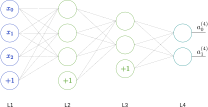
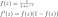
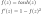
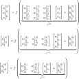
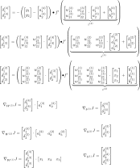
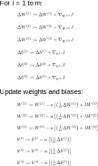

# Neural networks

*All Equations of the forward and backward pass of a neural network with two hidden layers*

## Graph

## Activation Functions

### Sigmoid

### Tangens hyperbolicus

## Forward pass

## Backward pass

## Parameter update

