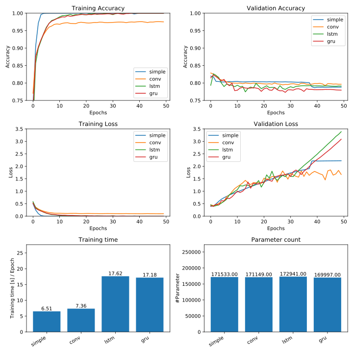

# Natural Language Processing

## Load data

### Tensorflow Dataset

```python
import tensorflow_datasets as tfds
imdb, info = tfds.load("imdb_reviews", with_info=True, as_supervised=True)
import numpy as np

train_data, test_data = imdb['train'], imdb['test']

training_sentences = []
training_labels = []

testing_sentences = []
testing_labels = []

# str(s.tonumpy()) is needed in Python3 instead of just s.numpy()
for s,l in train_data:
  training_sentences.append(str(s.numpy()))
  training_labels.append(l.numpy())

for s,l in test_data:
  testing_sentences.append(str(s.numpy()))
  testing_labels.append(l.numpy())

training_labels_final = np.array(training_labels)
testing_labels_final = np.array(testing_labels)
```

### Custom Dataset

```python
import json

with open('sarcasm.json', 'r') as f:
    datastore = json.load(f)

sentences = []
labels = []
urls= []
for item in datastore:
    sentences.append(item['headline'])
    labels.append(item['is_sarcastic'])
    urls.append(item['article_link'])

training_size = int(0.8*len(sentences))

training_sentences = sentences[0:training_size]
testing_sentences = sentences[training_size:]
training_labels = labels[0:training_size]
testing_labels = labels[training_size:]

training_labels_final = np.array(training_labels)
testing_labels_final = np.array(testing_labels)
```

## Word based encoding

Idee: assign a number to every word. Words not in the vocab gets an "<OOV>" (out of vocabulary) token assigned. Padding adds fills in zero values to make the output always a fixed size.

### Use pre-tokenized dataset

```python
import tensorflow_datasets as tfds
imdb, info = tfds.load("imdb_reviews/subwords8k", with_info=True, as_supervised=True)
train_data, test_data = imdb['train'], imdb['test']

tokenizer = info.features['text'].encoder
print(tokenizer.subwords)
```

Output:

```bash
[u'the_', u', ', u'. ', u'a_', u'and_', u'of_', u'to_', u's_', u'is_', u'br', u'in_', u'I_', ...]
```

```python
sample_string = "TensorFlow, from basics to mastery"

tokenized_string = tokenizer.encode(sample_string)
print(tokenized_string)

original_string = tokenizer.decode(tokenized_string)
print(original_string)
```

Output:

```bash
[6307, 2327, 4043, 2120, 2, 48, 4249, 4429, 7, 2652, 8050]
TensorFlow, from basics to mastery
```

### Tokenize custom dataset

```
I Love my dog -> 001, 002, 003, 004
I Love my cat -> 001, 002, 003, 005
```

```python
import tensorflow as tf
from tensorflow.keras.preprocessing.text import Tokenizer
from tensorflow.keras.preprocessing.sequence import pad_sequences

vocab_size = 10000
oov_tok = "<OOV>"
padding_type = "post"
trunc_type = "post"
max_length = 120

tokenizer = Tokenizer(num_words=vocab_size, oov_token=oov_tok)
tokenizer.fit_on_texts(training_sentences)

word_index = tokenizer.word_index

training_sequences = tokenizer.texts_to_sequences(training_sentences)
training_padded = pad_sequences(training_sequences, maxlen=max_length,
    padding=padding_type, truncating=trunc_type)

testing_sequences = tokenizer.texts_to_sequences(testing_sentences)
testing_padded = pad_sequences(testing_sequences, maxlen=max_length,
    padding=padding_type, truncating=trunc_type)
```

## Build a model

### Simple model

```python
model = tf.keras.Sequential([
    tf.keras.layers.Embedding(tokenizer.vocab_size, 64, input_length=max_length),
    tf.keras.layers.GlobalAveragePooling1D(),
    tf.keras.layers.Dense(24, activation='relu'),
    tf.keras.layers.Dense(1, activation='sigmoid')
])

model.compile(loss='binary_crossentropy', optimizer='adam', metrics=['accuracy'])
model.summary()
```

### LSTM model

```python
model = tf.keras.Sequential([
    tf.keras.layers.Embedding(tokenizer.vocab_size, 64, input_length=max_length),
    tf.keras.layers.Bidirectional(tf.keras.layers.LSTM(64, return_sequences=True)),
    tf.keras.layers.Bidirectional(tf.keras.layers.LSTM(64)),
    tf.keras.layers.Dense(24, activation='relu'),
    tf.keras.layers.Dense(1, activation='sigmoid')
])
```

### GRU model

```python
model = tf.keras.Sequential([
    tf.keras.layers.Embedding(tokenizer.vocab_size, 64, input_length=max_length),
    tf.keras.layers.Bidirectional(tf.keras.layers.GRU(64)),
    tf.keras.layers.Dense(24, activation='relu'),
    tf.keras.layers.Dense(1, activation='sigmoid')
])
```

### Convolutional model

```python
model = tf.keras.Sequential([
    tf.keras.layers.Embedding(tokenizer.vocab_size, 64, input_length=max_length),
    tf.keras.layers.Conv1D(128, 5, activation='relu'),
    tf.keras.layers.GlobalAveragePooling1D(),
    tf.keras.layers.Dense(24, activation='relu'),
    tf.keras.layers.Dense(1, activation='sigmoid')
])
```

### Model Comparison

[Code](./code/npl-net-comp.py)



## Train the model

```python
num_epochs = 10

history = model.fit(
    training_padded, training_labels_final,
    epochs=num_epochs,
    validation_data=(testing_padded, testing_labels_final))
```

## Visualize Embedding

```python
import io

e = model.layers[0]
weights = e.get_weights()[0]

out_v = io.open('vecs.tsv', 'w', encoding='utf-8')
out_m = io.open('meta.tsv', 'w', encoding='utf-8')

for word_num in range(1, vocab_size):
    word = reverse_word_index[word_num]
    embeddings = weights[word_num]
    out_m.write(word + "\n")
    out_v.write("\t".join([str(x) for x in embeddings]) + "\n")
out_v.close()
out_m.close()
```

Upload the files to [Tensorflow Embedding Projector](https://projector.tensorflow.org/)

# Source

* Coursera Course [Natural Language Processing in TensorFlow](https://www.coursera.org/learn/natural-language-processing-tensorflow/)
