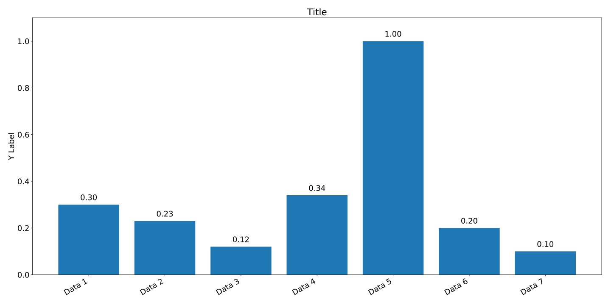

# Matplotlib



<details><summary>Show</summary>
<p>

```python
import matplotlib.pyplot as plt
import matplotlib as mpl
import numpy as np


mpl.rcParams['font.serif'] = 'Myriad Pro Light'
mpl.rcParams['font.size'] = 18

data = [0.3, 0.23, 0.12, 0.34, 1.0, 0.2, 0.1]
names = ["Data 1", "Data 2", "Data 3", "Data 4", "Data 5", "Data 6", "Data 7"]

fig = plt.figure(figsize=(20.0, 10.0))
plt.title('Title')
X = np.arange(len(names))

rects = plt.bar(X, data, align='center')
for val, rect in zip(data, rects):
    height = rect.get_height()
    plt.gca().text(rect.get_x() + rect.get_width()/2.,
                   height+0.0125,
                   '{:.2f}'.format(val),
                   ha='center',
                   va='bottom')

plt.xticks(X, names, rotation=30., ha='right')

ylim_upper = np.ceil(max(data) * 10.0) / 10.0 + 0.1
plt.ylim([0, ylim_upper])
plt.ylabel('Y Label')

plt.tight_layout()
plt.savefig("plot.svg")
plt.close(fig)
```

</p>
</details>
