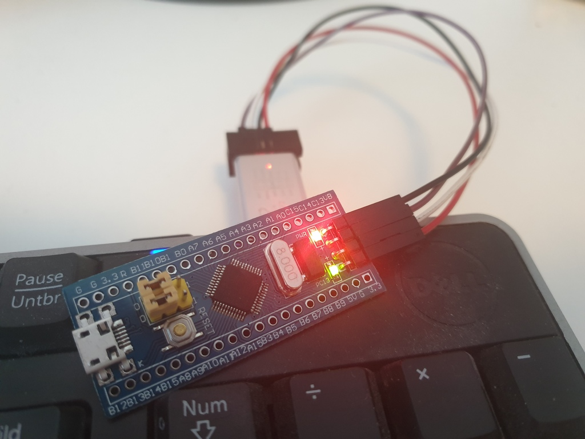

# STM32F103C8T6 Dev Board



## Pinout


## Install

1. Open VSCode Extension Manager
2. Search for official PlatformIO IDE extension
3. Install PlatformIO IDE
4. PIO Home -> New Project
5. Board: BlackPill F103C8, Framework: libOpenCM3

## Use

<details><summary>Blinky</summary>

```c++
#include <libopencm3/stm32/rcc.h>
#include <libopencm3/stm32/gpio.h>

int main(void) {
    rcc_periph_clock_enable(RCC_GPIOC);
    gpio_set_mode(GPIOC, GPIO_MODE_OUTPUT_2_MHZ,
        GPIO_CNF_OUTPUT_PUSHPULL, GPIO13);

    while(1) {
        gpio_clear(GPIOC, GPIO13);
        for (int i = 0; i < 100000; i++) {
            __asm__("nop");
        }
        gpio_set(GPIOC, GPIO13);
        for (int i = 0; i < 100000; i++) {
            __asm__("nop");
        }
    }

    return 0;
}
```
</details>

<details><summary>Blinky FreeRTOS</summary>

```c++
#include "FreeRTOS.h"
#include "task.h"

#include <libopencm3/stm32/rcc.h>
#include <libopencm3/stm32/gpio.h>

extern void vApplicationStackOverflowHook(xTaskHandle *pxTask, signed portCHAR *pcTaskName);
void vApplicationStackOverflowHook(
    xTaskHandle *pxTask __attribute__((unused)), 
    signed portCHAR *pcTaskName __attribute__((unused))) {
	for (;;);
}

static void task1(void *args __attribute__((unused))) {
    for (;;) {
		gpio_toggle(GPIOC, GPIO13);
		vTaskDelay(pdMS_TO_TICKS(1000));
	}
}

int main(void) {
    // Use External crystal
    rcc_clock_setup_in_hse_8mhz_out_72mhz();
    rcc_periph_clock_enable(RCC_GPIOC);
	gpio_set_mode(
		GPIOC,
		GPIO_MODE_OUTPUT_2_MHZ,
		GPIO_CNF_OUTPUT_PUSHPULL,
		GPIO13);

	// Turn LED off
	gpio_set(GPIOC, GPIO13);
	xTaskCreate(task1, "LED", 100, NULL, 2, NULL);
	vTaskStartScheduler();

	for (;;);
	return 0;
}
```
</details>

<details><summary>GPIO Input</summary>

```c++
#include <libopencm3/stm32/rcc.h>
#include <libopencm3/stm32/gpio.h>
// [...]
rcc_periph_clock_enable(RCC_GPIOC);
gpio_set_mode(
    GPIOC,
    GPIO_MODE_INPUT,
    GPIO_CNF_INPUT_ANALOG, /* GPIO_CNF_INPUT_FLOAT | GPIO_INPUT_PULL_UPDOWN  */
    GPIO13
);
// [...]
uint16_t gpio_get(uint32_t gpioport, uint16_t gpios);
uint16_t gpio_port_read(uint32_t gpioport);
```
</details>

<details><summary>GPIO Output</summary>

```c++
#include <libopencm3/stm32/rcc.h>
#include <libopencm3/stm32/gpio.h>
// [...]
rcc_periph_clock_enable(RCC_GPIOC);
gpio_set_mode(
    GPIOC,
    GPIO_MODE_OUTPUT_2_MHZ, /* GPIO_MODE_OUTPUT_10_MHZ | GPIO_MODE_OUTPUT_50_MHZ */
    GPIO_CNF_OUTPUT_PUSHPULL, /* GPIO_CNF_OUTPUT_OPENDRAIN */
    GPIO13
);
// [...]
void gpio_set(uint32_t gpioport, uint16_t gpios);
void gpio_clear(uint32_t gpioport, uint16_t gpios);
void gpio_toggle(uint32_t gpioport, uint16_t gpios);
void gpio_port_write(uint32_t gpioport, uint16_t data);
```
</details>

## Source

* [Beginning STM32 Developing with FreeRTOS, libopencv3 and GCC by Warren Gay](https://www.amazon.de/Beginning-STM32-Developing-FreeRTOS-libopencm3/dp/1484236238)
* [Blinky platformIO/libopencm3/freertos](https://github.com/bjwschaap/platformio-libopencm3-freertos)
