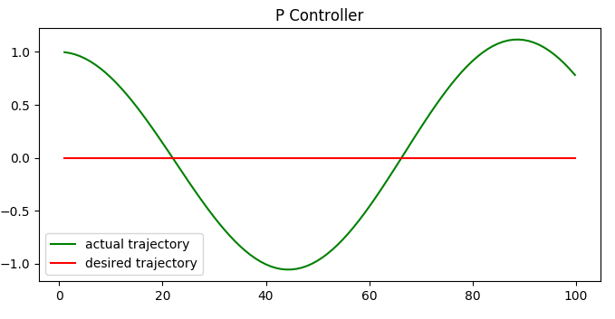
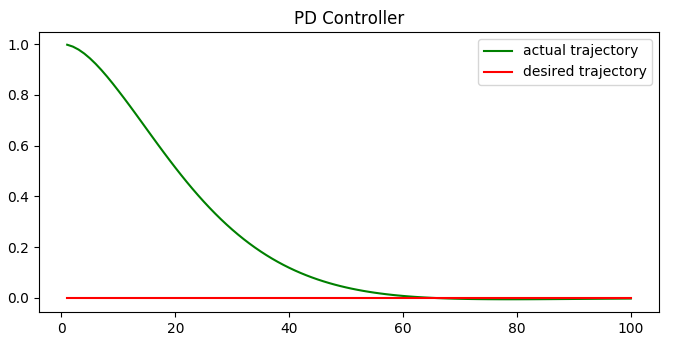
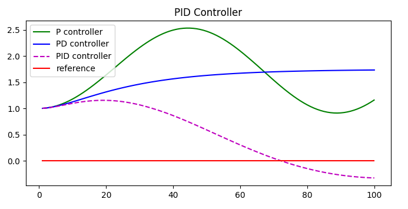
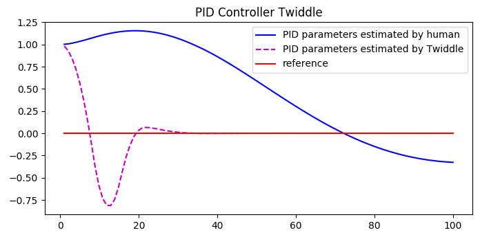

# Control Theory

*The Goal of control theory is to pick control actions in an optimum manner without delay or overshoot and ensuring control stability [[1]](https://en.wikipedia.org/wiki/Control_theory)*

## PID - Control

Example: Controlling a car to drive along x-axis

**P ... Proportional**

```control_action = -Kp * error```



* Problem: Overshoot
* Solution: Add differential

**D ... Differential**

```control_action = -Kp * error - Kd * diff_error```



* Another problem: system bias. Example: Car wheels are off-center
* Solution: Add an Integral Part

**I ... Integral**

```control_action = -Kp * error - Kd * diff_error - Ki * sum_error```



**Source Code**

```python
prev_error = robot.y
sum_error = 0
dt = 1.0

# Simulation loop
for i in range(n):
    error = robot.y
    diff_error = (error - prev_error) / dt
    sum_error += error
    steer = -Kp * error - Kd * diff_error - Ki * sum_error
    robot.move(steer, speed)
```

## Finding good PID parameter values



**Step 1**: Have a cost function which tells how "good" the PID parameters are. For instance the mean cross track error over some simulation period can be used.

```python
def cost_func(robot, params, n=100, speed=1.0):
    prev_error = robot.y
    sum_error = 0
    mean_error = 0

    # Give the algorithm a chance to converge to 0 in n steps
    # Only from then on calculate the mean error
    for i in range(2*n):
        error = robot.y
        sum_error += error
        diff_error = (error - prev_error) / speed
        steer = -params[0] * error - params[1] * diff_error - params[2] * sum_error
        robot.move(steer, speed)
        prev_error = error
        if i >= n:
            mean_error += error ** 2
    return mean_error / n
```

**Step 2**: Implement the twiddle algorithm. The basic idea is to iterate over the parameters and then try out a value for the paramter which is dp above the parameter and dp below. If the change in value gives lowest cost so far then this parameter value is kept and dp is increased otherwise dp is decreased.

```python
def twiddle(tol=0.2): 
    p = [0, 0, 0]
    dp = [1, 1, 1]
    robot = make_robot()
    x_trajectory, y_trajectory, best_err = run2(robot, p)

    it = 0
    while sum(dp) > tol:
        print("Iteration {}, best error = {}".format(it, best_err))
        for i in range(len(p)):
            p[i] += dp[i]
            robot = make_robot()
            err = cost_func(robot, p)

            if err < best_err:
                best_err = err
                dp[i] *= 1.1
            else:
                p[i] -= 2 * dp[i]
                robot = make_robot()
                err = cost_func(robot, p)

                if err < best_err:
                    best_err = err
                    dp[i] *= 1.1
                else:
                    p[i] += dp[i]
                    dp[i] *= 0.9
        it += 1
    return p
```

**Step 3**: Run twiddle:

```python
Kp, Kd, Ki = twiddle()
```

## Source

* [Udacity Course - Artificial Intelligence for Robotics](https://classroom.udacity.com/courses/cs373)


