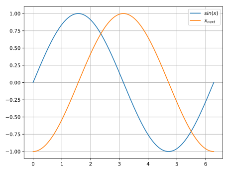

# Integrators

### Integrator Loop

```python
import numpy as np


start = 0.0
end = 2*np.pi
step = 0.001
f = lambda x, t: np.sin(t)  # Function to integrate

x_next = -1.0
discrete_time = np.arange(start, end, step)
for t in discrete_time:
    x_next = x_next + step*phi(f, x_next, t, step)
```

Example output:



### Euler

```python
def phi_eul(f, x, t, h):
    return f(x, t)
```

### VPG

```python
def phi_vpg(f, x, t, h):
    k1 = f(x, t)
    k2 = f((x+(h/2.0)*k1), t+h/2.0)
    return k2
```
```python
def vpg_error(f, x, t, h):
    k1 = f(x, t)
    k2 = f((x+(h/2.0)*k1), t+(h/2.0))
    k3 = f(x-h*k1+2.0*h*k2, t+h)
    return (h/6.0)*(k1-2.0*k2+k3)
```
### EHU

```python
def phi_ehu(f, x, t, h):
    k1 = f(x, t)
    k2 = f(x+h*k1, t+h)
    return (k1+k2)/2.0
```

### Runge-Kutta 3
 
```python
def phi_rk3(f, x, t, h):
    k1 = f(x, t)
    k2 = f(x+(h/2.0)*k1, t+h/2.0)
    k3 = f(x-h*k1+2.0*h*k2, t+h)
    return (k1+4.0*k2+k3)/6.0
```

### Runge-Kutta 3 with error

```python
def phi_rkf3(f, x, t, h):
    k1 = f(x, t)
    k2 = f(x+(1/4.0)*h*k1, t+(h/4.0))
    k3 = f(x+(4/81.0)*h*k1+(32/81.0)*h*k2, t+(4/9.0)*h)
    k4 = f(x+(57/98.0*h*k1-(432/343.0)*h*k2+(1053/686.0)*h*k3), t+(6/7.0)*h)
    return ((1/6.0)*k1+(27/52.0)*k3+(49/156.0)*k4)
```
```python
def rkf3_error(f, x, t, h):
    k1 = f(x, t)
    k2 = f(x+(1/4.0)*h*k1, t+(h/4.0))
    k3 = f(x+(4/81.0)*h*k1+(32/81.0)*h*k2, t+(4/9.0)*h)
    k4 = f(x+(57/98.0*h*k1-(432/343.0)*h*k2+(1053/686.0)*h*k3), t+(6/7.0)*h)
    # k1 of the next round:
    k5 = f(x+(1/6.0)*h*k1+(27/52.0)*h*k3+(49/156.0)*h*k4, t+h)
    return h*(-(5/288.0)*k1+(27/416.0)*k3-(245/1872.0)*k4+(1/12.0)*k5)
```

### Runge-Kutta 4

```python
def phi_rk4(f, x, t, h):
    k1 = f(x, t)
    k2 = f(x+(h/2.0)*k1, t+h/2.0)
    k3 = f(x+(h/2.0)*k2, t+(h/2.0))
    k4 = f(x-h*k3, t+h)
    return (k1+2*k2+2*k3+k4)/6.0
```

### Runge-Kutta 4 with error

```python
def phi_rkf4(f, x, t, h):
    k1 = f(x, t)
    k2 = f(x+(1/4.0)*h*k1, t+(1/4.0)*h)
    k3 = f(x+h*((3/32.0)*k1+(9/32.0)*k2), t+(3/8.0)*h)
    k4 = f(x+h*((1932/2197.0)*k1-(7200/2197.0)*k2+(7296/2197.0)*k3),
           t+(12/13.0)*h)
    k5 = f(x+h*((439/216.0)*k1-8.0*k2+(3680/513.0)*k3-(845/4104.0)*k4), t+h)
    return (25/216.0)*k1+(1408/2565.0)*k3+(2197/4104.0)*k4-(1/5.0)*k5
```

```python
def rkf4_error(f, x, t, h):
    k1 = f(x, t)
    k2 = f(x+(1/4.0)*h*k1, t+(1/4.0)*h)
    k3 = f(x+h*((3/32.0)*k1+(9/32.0)*k2), t+(3/8.0)*h)
    k4 = f(x+h*((1932/2197.0)*k1-(7200/2197.0)*k2+(7296/2197.0)*k3),
           t+(12/13.0)*h)
    k5 = f(x+h*((439/216.0)*k1-8*k2+(3680/513.0)*k3-(845/4104.0)*k4), t+h)
    k6 = f(x+h*(-(8/27.0)*k1-2*k2-(3544/2565.0)*k3+(1859/4104.0) *
           k4-(11/55.0)*k5), t+(1/2.0)*h)
    return h*((1/360.0)*k1-(128/4275.0)*k3-(2197/75240.0)*k4+(1/50.0) *
              k5+(2/55.0)*k6)
```

### Trapezoidal Rule Integration

```python
def phi_tra(f, x, t, h, epsilon=10**-5):
    p = x
    p_next = p-(h/2.0)*(f(x, t)+f(p, t+h))

    while abs(p_next - p) > epsilon:
        p = p_next
        phi = p-x-(h/2.0)*(f(x, t)+f(p, t+h))
        J = (1-(1/2.0)*(f(p, t+h)-f(x, t)))
        J_inv = 1/J
        p_next = p-J_inv*phi
    return (f(x, t)+f(x_next, t+h))/2.0
```

### Adams-Bashforth

```python
x_save_adb4 = []
x_save_index = 0


def phi_adb4(f, x, t, h):  
    global x_save_adb4, x_save_index
    if len(x_save_adb4) < 3:
        x_save_adb4.append(x)
        return 0
    x1 = x_save_adb4[x_save_index]
    x2 = x_save_adb4[(x_save_index-1) % 3]
    x3 = x_save_adb4[(x_save_index-2) % 3]
    x_save_index = (x_save_index+1) % 3
    x_save_adb4[x_save_index] = x
    return (1/24.0)*(55*f(x, t)-59*f(x1, t)+37*f(x2, t)-9*f(x3, t))
```