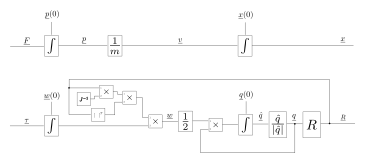

# Rigid Body Simulation



### Model code

```python
import numpy as np


# System parameters
inertia = np.array([[0.015, 0.000, 0.000],
                    [0.000, 0.015, 0.000],
                    [0.000, 0.000, 0.007]])
inverse_inertia = np.linalg.inv(inertia)
mass = 1.0
inverse_mass = 1.0 / mass

# Inputs
force = np.array([0.0, 0.0, 0.0])
torque = np.array([0.0, 0.0, 0.0])


def rigid_body(x, t):
    position = x[0:3]
    linear_momentum = x[3:6]
    angular_momentum = x[6:9]
    orientation_quaternion = x[9:14]

    linear_momentum_dot = force
    position_dot = inverse_mass * linear_momentum

    angular_momentum_dot = torque
    normalized_quaternion = normalize_quaternion(orientation_quaternion)
    rotation_matrix = quaternion_to_matrix(normalized_quaternion)
    angular_velocity = rotation_matrix.dot(inverse_inertia)\
                                      .dot(rotation_matrix.T)\
                                      .dot(angular_momentum)
    wx, wy, wz = angular_velocity
    Q = np.array([[0.0,  wz, -wy,  wx],
                  [-wz, 0.0,  wx,  wy],
                  [wy,  -wx, 0.0,  wz],
                  [-wx, -wy, -wz, 0.0]])
    orientation_dot = Q.dot(normalized_quaternion)

    x_dot = np.empty(13)
    y = np.empty(12)

    x_dot[0:3] = linear_momentum_dot
    x_dot[3:6] = position_dot
    x_dot[6:9] = angular_momentum_dot
    x_dot[9:13] = orientation_dot

    y[0:3] = position
    y[3:12] = rotation_matrix.ravel()

    return x_dot, y
```

### Helper functions

```python
def normalize_quaternion(q):
    return q / np.linalg.norm(q)
```

```python
def quaternion_to_matrix(q):
    return np.array([[1.0-2.0*q[2]*q[2]-2.0*q[3]*q[3],
                      2.0*(q[1]*q[2]-q[0]*q[3]),
                      2.0*(q[1]*q[3]+q[0]*q[2])],
                     [2.0*(q[1]*q[2]+q[0]*q[3]),
                      1.0-2.0*q[1]*q[1]-2.0*q[3]*q[3],
                      2.0*(q[2]*q[3]-q[0]*q[1])],
                     [2.0*(q[1]*q[3]-q[0]*q[2]),
                      2.0*(q[2]*q[3]+q[0]*q[1]),
                      1.0-2.0*q[1]*q[1]-2*q[2]*q[2]]])
```