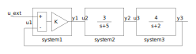
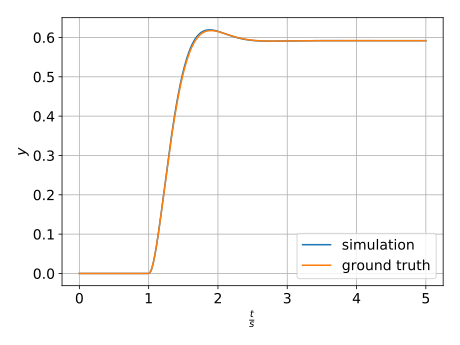

# Structuring a Simulation

### Example: Second Order System



### Step response



### Simulation loop
*sim_closed_loop.py*
```python
import numpy as np

from sys_pt2_c1 import sys_pt2_c1
from rk4 import rk4


# system parameter
model = sys_pt2_c1
u = [0.0]  # input modeled in the topology file

# simulation parameter
t = 0.0
tf = 5.0
h = 1e-3
ts = 1.0

# initial values
x = np.array([0.0, 0.0])  # x ... system state vector

# simulation
t_values = np.arange(t, tf+h, h)
N = len(t_values)
x_values = np.zeros((N, x.shape[0]))
y_values = np.zeros((N, 3))
y_exact = np.zeros((N))

for i, t in enumerate(t_values):
    (x, y) = rk4(model, x, u, t, h)
    x_values[i, :] = x
    y_values[i, :] = y
    y_exact[i] = 0.0 if t <= ts else (29.0 / 49.0) *\
        (1.0-np.exp(-3.5*(t-ts))*(np.cos(3.5*(t-ts)) + np.sin(3.5*(t-ts))))
```

### Integrator
*rk4.py*
```python
def rk4(f, x, u, t, h):
    '''Standard Runge Kutta 4th Order.
    '''
    k1, y = f(x, t)
    k2, _ = f(x+(h/2.0)*k1, t+h/2.0)
    k3, _ = f(x+(h/2.0)*k2, t+(h/2.0))
    k4, _ = f(x-h*k3, t+h)
    return x + h/6.0*(k1+2*k2+2*k3+k4), y
```

### Topology description
*sys_pt2_c1.py*
```python
import system_1 as system_1
import system_2 as system_2
import system_3 as system_3


def sys_pt2_c1(x, t):
    """Topology description of simulation model.

    Args:
      x: system state vector at t
      t: current time

    Returns:
      xdot: system state vector derivative at t
      y: subsystem outputs at t
    """
    # u_ext = u_ext(t) # modeled as internal part of the system
    ts = 1.0
    if t < ts:
        u_ext = 0.0
    elif t >= ts:
        u_ext = 1.0
    else:
        u_ext = 0.0

    xdot = np.empty(2)
    u1 = np.empty(2)
    y = np.empty(3)

    # system_3 ---> Start block
    # xdot undefined because input u3 not yet known
    _, y3_start = system_3([x[1]], [0.0], t)

    # system_1
    u1 = np.array([u_ext, y3_start])
    _, y[0] = system_1([0], u1, t)  # no states

    # system_2
    u2 = np.array([y[0]])
    xdot[0], y[1] = system_2([x[0]], u2, t)

    # system_3
    # xdot is now correct because the input is known
    u3 = np.array([y[1]])
    xdot[1], y[2] = system_3([x[1]], u3, t)

    return xdot, y
```

### Subsystem 1
*system_1.py*
```python
def system_1(x, u, t):
    k = 29.0 / 24.0

    # state equation (derivative)
    xdot = np.array([0.0])  # no states, dummy output

    # output equation
    y = np.array([k * (u[0]-u[1])])

    return xdot, y
```

### Subsystem 2
*system_2.py*
```python
def system_2(x, u, t):
    # state equation (derivative)
    xdot = np.array([-5.0 * x[0] + u[0]])

    # output equation
    y = np.array([3.0 * x[0]])

    return xdot, y
```

### Subsystem 3
*system_3.py*
```python
def system_3(x, u, t):
    # state equation (derivative)
    xdot = np.array([-2.0*x[0] + u[0]])

    # output equation
    y = np.array([4.0*x[0]])

    return xdot, y
```
