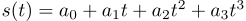
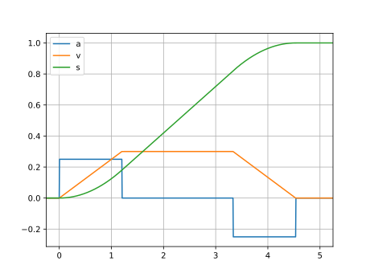

# Trajectory Generator

### Given

* Initial State **s0** at time **t0**
* Final State **sf** at time **tf**

### Required

* Smooth trajectory between **s0** and **sf**

### Approach

0. Cubic Trajectory



1. Find parameter **a0** ... **a4**


**Special case**: Interpolate between two rotation matrices

0. Calculate difference of rotation matrices:

```python
R_0_f = R0.T.dot(Rf)
```

1. Decompose rotation into vector and angle 

```python
vector, angle = toEuler(R_0_f)
```

```python
def toEuler(R):
    angle = arccos((R[0, 0]+R[1, 1]+R[2, 2]-1.0)/2.0)
    vector = np.array([R[2, 1]-R[1, 2],
                       R[0, 2]-R[2, 0],
                       R[1, 0]-R[0, 1]])
    s = sin(angle)
    if s == 0:
        return (0, 0, 0), 0
    vector *= 1.0/(2.0*sin(angle))
    return vector, angle
```

2. Interpolate between 0 and angle

3. To get intermediate values for the rotation matrix use:

```python
def toRotationMatrix(vector, angle):
    s = sin(angle)
    c = cos(angle)
    x, y, z = vector[0:3]
    return np.array([[c+x*x*(1-c), x*y*(1-c)-z*s, x*z*(1-c)+y*s],
                     [y*x*(1-c)+z*s, c+y*y*(1-c), y*z*(1-c)-x*s],
                     [z*x*(1-c)-y*s, z*y*(1-c)+x*s, c+z*z*(1-c)]])
```

### Piecewise linear trajectory with parabolic transitions

*Use this if you need a smoth trajectory with limits in velocity and acceleration*



```python
def trajectory(t, t0, s0, sf, v_max, a_max):
    sign = np.sign(sf - s0)
    delta_s = abs(sf - s0)
    v_star = min(v_max, np.sqrt(delta_s*a_max))

    delta_s0 = (0.5 * v_star * v_star) / a_max
    delta_s1 = delta_s - (v_star * v_star)  / a_max

    t1 = t0 + v_star / a_max
    t2 = t0 + delta_s / v_star
    t3 = t2 + v_star / a_max

    a = 0.0
    v = 0.0
    s = 0.0

    if t >= t0 and t < t1:
        a = sign * a_max
        v = sign *a_max * (t - t0)
        s = sign * 0.5 * a_max * (t - t0) * (t - t0) + s0
    elif t >= t1 and t < t2:
        a = 0
        v = sign * v_star
        s = sign * (v_star * (t - t1) + delta_s0) + s0
    elif t >= t2 and t <= t3:
        a = -1.0 * sign * a_max
        v  = sign * (v_star - a_max * (t - t2))
        s = sign * (- 0.5 * a_max * (t - t2) * (t - t2) + v_star * (t - t2) + delta_s0 + delta_s1) + s0
    elif t > t3:
        a = 0.0
        v  = 0.0
        s = sf
    elif t < t0:
        a = 0.0
        v  = 0.0
        s = s0        
    return a, v, s, t0, t1, t2, t3
```

```cpp
void trajectory(
        double t, double t0, double s0,
        double sf, double v_max, double a_max,
        double* a, double* v, double* s) {
    double sign = (sf - s0 >= 0.0)?1:-1;
    double delta_s = std::abs(sf - s0);
    double v_star = std::min(v_max, std::sqrt(delta_s*a_max));
    double delta_s0 = (0.5 * v_star * v_star) / a_max;
    double delta_s1 = delta_s - (v_star * v_star)  / a_max;
    double t1 = t0 + v_star / a_max;
    double t2 = t0 + delta_s / v_star;
    double t3 = t2 + v_star / a_max;
    *a = 0;
    *v = 0;
    *s = 0;
    if (t >= t0 && t < t1) {
        *a = sign * a_max;
        *v = sign * a_max * (t - t0);
        *s = sign * 0.5 * a_max * (t - t0) * (t - t0) + s0;
    } else if (t >= t1 && t < t2 ) {
        *a = 0;
        *v = sign * v_star;
        *s = sign * (v_star * (t - t1) + delta_s0) + s0;
    } else if (t >= t2 && t <= t3) {
        *a = -a_max * sign;
        *v  = sign * (v_star - a_max * (t - t2));
        *s = sign * (- 0.5 * a_max * (t - t2) * (t - t2) + v_star * (t - t2) + delta_s0 + delta_s1) + s0;
    } else if (t > t3) {
        *s = sf;
    } else if (t < t0) {
        *s = s0;
    }
}
```
