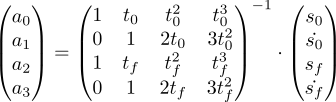

# Trajectory Generator

### Given

* Initial State s0 at time t0
* Final State sf at time tf

### Required

* Smooth trajectory between s0 and sf

### Approach

0. Cubic Trajectory


1. Find parameter a0 ... a4



Special case: Interpolate between two rotation matrices

0. Calculate difference of rotation matrices:

```python
R_0_f = R0.T.dot(Rf)
```

1. Decompose rotation into vector and angle 

```python
vector, angle = toEuler(R_0_f)
```

```python
def toEuler(R):
    angle = arccos((R[0, 0]+R[1, 1]+R[2, 2]-1.0)/2.0)
    vector = np.array([R[2, 1]-R[1, 2],
                       R[0, 2]-R[2, 0],
                       R[1, 0]-R[0, 1]])
    s = sin(angle)
    if s == 0:
        return (0, 0, 0), 0
    vector *= 1.0/(2.0*sin(angle))
    return vector, angle
```

2. Interpolate between 0 and angle

3. To get intermediate values for the rotation matrix use:

```python
def toRotationMatrix(vector, angle):
    s = sin(angle)
    c = cos(angle)
    x, y, z = vector[0:3]
    return np.array([[c+x*x*(1-c), x*y*(1-c)-z*s, x*z*(1-c)+y*s],
                     [y*x*(1-c)+z*s, c+y*y*(1-c), y*z*(1-c)-x*s],
                     [z*x*(1-c)-y*s, z*y*(1-c)+x*s, c+z*z*(1-c)]])
```
